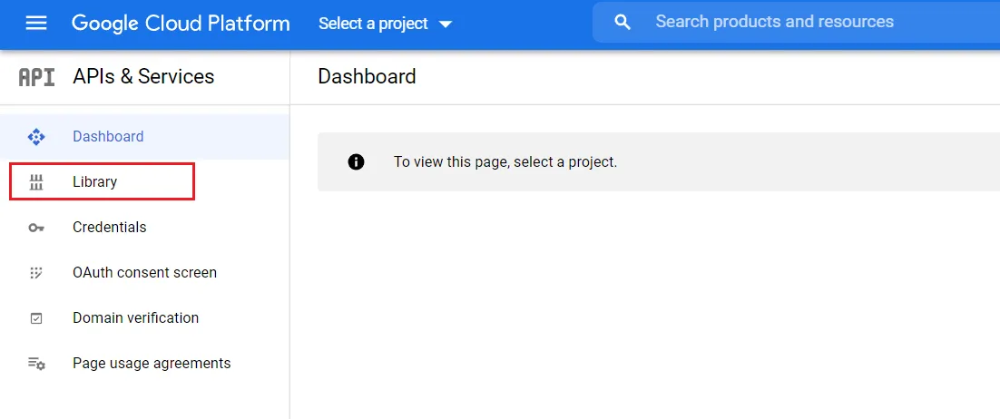
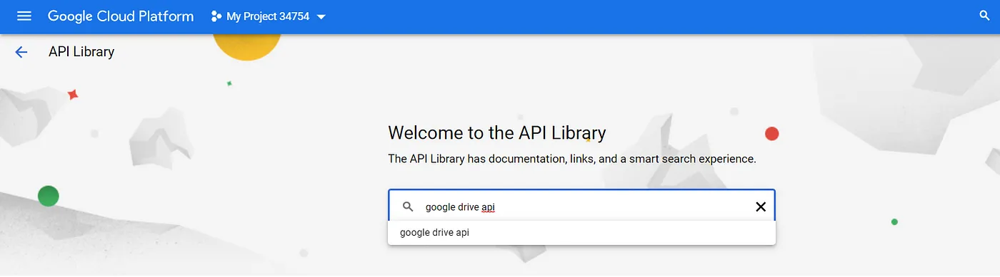
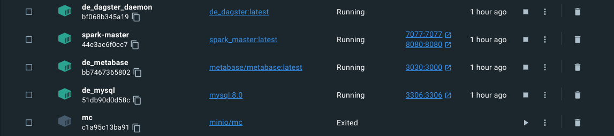

# goodreads-elt-pipeline

For Vietnamese edition, please visit https://lelouvincx.github.io/projects/fde2-goodreads-elt-pipeline/

In this project, I will guide you on building a basic data pipeline using the ELT model (extract - load - transform), using the dataset from Goodreads to ingest and transform data to serve a book recommendation system for yourself.

This project is completed based on the knowledge learned from the Fundamental Data Engineering 02 course of AIDE. Special thanks to Mr. Nguyen Thanh Binh, Mr. Ong Xuan Hong, and Mr. Hung Le.

## 1. Introduction

I love reading books, and I have a Kindle e-reader for my daily reading.


One thing I like about the Kindle is that it has a separate email address provided by Amazon. If I use my own email to send e-book files (in .epub/.mobi format), the Amazon system will automatically send the files to my Kindle as long as there is an internet connection.

So why not build an app that can extract data from Goodreads (a social network for book lovers), process it, and provide recommendations for my next reads? And that's where the project begins :D

## 2. Objective

Dataset is collected from [Kaggle](https://www.kaggle.com/datasets/bahramjannesarr/goodreads-book-datasets-10m), [OpenLibrary API](https://openlibrary.org), [Google Drive API](https://developers.google.com/drive) and [Notion API](https://www.notion.so/lelouvincx/9dca269701b44d6b944c51a7f63b5b5a?v=4852b4d5cf8440e4bc232b0e25327f93)

The objective of the project is to provide book recommendations to users based on the processed data collected. When a user inputs information about a book they have read, the app will suggest potential next reads. If the book has an .epub file, the app will also have a feature to send the book to the user's Kindle.

## 3. Design

### 3.1 Directory tree


- `app`: The UI's application written with streamlit
- `dagster_home`: Dagit and dagster daemon's configurations
- `dataset`: Dataset under .csv format, in order to load into MySQL
- `docker-compose`: To compose docker containers
- `dockerimages`: Include self-built docker images, such as dagster (for dagit + daemon), spark master, streamlit app, ...
- `EDA.ipynb`: Exploratory Data Analysis, view directly [here](https://gist.github.com/lelouvincx/a88fa6caf59d7ff76086ab485ecc69bd)
- `elt_pipeline`: The pipeline
  - `dbt_transform`: dbt's code location, used for the last transform step
  - `Dockerfile + requirements.txt`: Docker image
  - `elt_pipeline`: EL (Extract -> Transform) pipeline
- `.env + .spark_master.env + .spark_worker.env`: Env variables (e.g POSTGRES_USER, MYSQL_USER, SPARK, ...)
- `env.template`: Env variables template
- `.git + .gitignore`: Code versioning
- `Makefile`: Shortcut for terminal's commands
- `load_dataset`: .sql scripts to create schema and load `dataset` into MySQL, Postgres
- `requirements.txt + Pipfile + Pipfile.lock`: Python's dependencies

In addition, the containers also have their own separate directories, which include:

- `minio`
- `storage`
  - `mysql_data`
  - `postgres_data`
  - `metabase_data`

Visit file [tree.txt](https://github.com/lelouvincx/goodreads-elt-pipeline/blob/main/tree.txt) for more details.

### 3.2 Pipeline design


0. We use docker to containerize the application and dagster to orchestrate assets (as defined in dagster's [documentation](https://docs.dagster.io/concepts/assets/software-defined-assets)).
1. Goodreads data is downloaded from Kaggle in `.csv` format, then imported into `MySQL` to simulate development data
2. After obtaining the book's ISBN (international standard book number), collect additional data from relevant APIs:
   - Genre, author, pages number, image, description from `OpenLibrary API`
   - Download link from `Notion API`
   - Epub file from `Google Drive API`
   - Image from `OpenLibrary API` or `Google Drive API`
3. Extract the table-formatted data above using `polars`, and load it into the datalake - `MinIO`.
4. From `MinIO`, load data into `spark` to transform from raw into silver & gold
5. Convert `Spark DataFrame` to `.parquet`, and load back to `MinIO`
6. Load gold layer into data warehouse - postgreSQL, creating the warehouse layer.
7. Transform as needed using `dbt` on `postgres`
8. Visualize the data using `metabase`
9. Create a book recommendation app using `streamlit`

### 3.3 Database schema


1. `book`: OLTP table contains books' infomation (e.g ISBN, Authors, Rating, Description...)
2. `genre`: table contains genres
3. `book_genre`: n-n relationship of `book` and `genre`
4. `book_download_link`: table contains link google drive
5. `files`: object storage contains books' download files (.epub/.pdf/.mobi)
6. `images`: object storage contains books' images

### 3.4 Datalake structure


1. The datalake is divided into three layers: bronze, silver, and gold.
2. All files are under the .parquet format for better reading performance than .csv.
3. There are also `files` that stores .epub files in the format of abc.epub, where abc is the ISBN of the book.
4. Similarly, abc.jpeg stores the image of the book.

### 3.5 Data lineage

1. General


With a dense data lineage, Dagster is a big help when it comes to visualizing it in a clear way:

- Data originates from MySQL and various APIs, and is loaded into the bronze layer.
- From the bronze layer, data is deduped, cleaned, and missing values are filled in the silver layer.
- Advanced computations and splitting are then performed in the gold layer.
- The data is loaded into the data warehouse - Postgres - in the warehouse layer.
- Finally, transformations are made according to needs in the recommendations layer using dbt.

2. Bronze layer


Includes these assets:

- bronze_book: Table `book` from MySQL, because too large (over 1.2 million rows) it is partitioned by year from 1975 to 2022.
- bronze_genre: Table `genre` from MySQL.
- bronze_book_genre: Table `book_genre` from MySQL.
- bronze_book_download_link: Table `book_download_link` from MySQL.
- bronze_images_and_files_download: Đảm nhận việc kết nối tới google drive api, kéo file .epub và hình ảnh về, lưu trong datalake.
- bronze_images_and_files_download: Responsible for connecting to the Google Drive API, pulling the .epub file and images, and storing them in the datalake.

3. Silver layer


Includes these assets:

- silver_cleaned_book: Data cleaning from upstream `bronze_book`, partitioned to ensure `spark standalone mode` can run efficiently.
- silver_collected_book: Collect missing data from upstream such as authors, pages number, and description from `OpenLibrary API`.
- silver_isbn: Extract the isbn column from book to serve as a dependency for assets related to genre.
- silver_cleaned_genre: Similar to `silver_cleaned_book`, but doesn't need partitioning as its size is not very large.
- silver_collected_genre: Based on `silver_isbn`, collect missing genres for each book. If there is no genre, it cannot be used for recommendations in subsequent tasks.
- silver_collected_book_genre: Establish the n-n relationship between book and genre.

4. Gold layer


Includes these assets:

- gold_genre: Compute and sort genres to match from upstream `silver_collected_genre`, while also saving them to minIO.
- gold_book_genre: Similarly, from upstream `silver_collected_book_genre`.
- gold_with_info: Splitting, containing only basic information about the book such as ISBN, Name, Authors, Language, PagesNumber.
- gold_with_publish: Splitting, containing information about the publisher, publication time.
- gold_with_rating: Splitting and computing different types of ratings.

5. Warehouse layer


Load the assets from the gold layer into Postgres, including one asset from the bronze layer which is book_download_link.

In the future, the assets will be updated to add download links automatically from the Notion API, and a schedule will be set up.

6. Transform layer


Includes these assets:

- search: Transform information to create an index table, which will be queried when users search for books.
- search_prior: Also an index table, but contains books that are given priority based on factors such as availability of download links, functionality of the OpenLibrary API, high ratings, etc.
- criteria: Criteria used to query related books when searching for a specific book.

## 4. Setup

### 4.1 Prequisites

To develop this pipeline, download and install these softwares:

1. [Git](https://git-scm.com/book/en/v2/Getting-Started-Installing-Git)
2. [Docker](https://docs.docker.com/engine/install/) with at least 4GB RAM, 6 core CPU, 2GB swap, 16GB disk
3. [CMake](https://cmake.org/install/), nếu dùng hệ máy UNIX (Linux/MacOS), check `make --version` already installed
4. Python 3.x (3.9.16 recommended as the Spark image runs on this version, installing via asdf is recommended) and a virtual environment (pipenv recommended)
5. A local machine that has freed the following ports: 3306, 5432, 9000, 9001, 3001, 8501, 4040, 7077, 8080, 3030
6. Dbeaver or any other DB client (if not available, can use command-line)

If using Windows, set up WSL2 and a local Ubuntu virtual machine, then install the above software for Ubuntu.

Clone the repository

```bash
git clone https://github.com/lelouvincx/goodreads-elt-pipeline.git project
cd project
```

### 4.2 Setup google drive api

Firstly we need to create an OAuth 2.0 token to google, [Google API Console](https://console.developers.google.com/).

Select `create new project`:


Fill in project's name (goodreads-elt_pipeline), choose location (default `No organization`).


After creating project, select tab `Library`:



Search `Google Drive API`, enable it.




Next, select tab `OAuth consent screen`,


Fill in below information:


In `scopes`, select `add or remove scopes`, look for `google drive api, readonly` then tick, `save and continue` until end.


Select tab `credentials` -> `create credentials` then `OAuth client ID`.


Select `Desktop app`, name as you like (default: goodreads-elt-pipeline)


Download json and place in `project/elt_pipeline/elt_pipeline`


### 4.3 Setup local infrastructure

Clone repository:

```bash
# Create env file
touch .env
cp env.template .env
touch .spark_master.env
cp spark_master.env.template .spark_master.env
touch .spark_worker.env
cp spark_worker.env.template .spark_worker.env
```

Then fill in the infomation into the above env files, for examples:

```env
# MySQL
MYSQL_HOST=de_mysql
MYSQL_PORT=3306
MYSQL_DATABASE=goodreads
MYSQL_USER=admin
MYSQL_PASSWORD=admin123
MYSQL_ROOT_PASSWORD=root123

# PostgreSQL
POSTGRES_HOST=de_psql
POSTGRES_PORT=5432
POSTGRES_USER=admin
POSTGRES_PASSWORD=admin123
POSTGRES_DB=goodreads
POSTGRES_HOST_AUTH_METHOD=trust

# Google Drive
GDRIVE_CLIENT_SECRET_FILE=client_secret.json
GDRIVE_PICKLE_FILE=token_drive_v3.pickle
GDRIVE_API_NAME=drive
GDRIVE_API_VERSION=v3
GDRIVE_SCOPES=https://www.googleapis.com/auth/drive.readonly

# Dagster
DAGSTER_PG_HOSTNAME=de_psql
DAGSTER_PG_USERNAME=admin
DAGSTER_PG_PASSWORD=admin123
DAGSTER_PG_DB=postgres
DAGSTER_OVERALL_CONCURRENCY_LIMIT=1
DAGSTER_HOME=/opt/dagster/dagster_home

# dbt
DBT_HOST=de_psql
DBT_USER=admin
DBT_PASSWORD=admin123
DBT_DATABASE=goodreads
DBT_SCHEMA=recommendations
# MinIO
MINIO_ENDPOINT=minio:9000
MINIO_ROOT_USER=minio
MINIO_ROOT_PASSWORD=minio123
MINIO_ACCESS_KEY=minio
MINIO_SECRET_KEY=minio123
DATALAKE_BUCKET=lakehouse
AWS_ACCESS_KEY_ID=minio
AWS_SECRET_ACCESS_KEY=minio123
AWS_REGION=us-east-1

# MinIO client (mc)
AWS_ACCESS_KEY_ID=minio
AWS_SECRET_ACCESS_KEY=minio123
AWS_REGION=us-east-1

# Spark
SPARK_MASTER_URL=spark://spark-master:7077
SPARK_VERSION=3.3.2
HADOOP_VERSION=3

# Metabase
MB_DB_TYPE=postgres
MB_DB_DBNAME=goodreads
MB_DB_PORT=5432
MB_DB_USER=admin
MB_DB_PASS=admin123
MB_DB_HOST=de_psql
MB_DB_FILE=/metabase_data/metabase.db
```

You can replace the infomation about user, password, ...

**For development only, do not use for production.**

```bash
# DO NOT RUN BOTH BELOW COMMANDS, ONLY CHOOSE ONE
# Setup python environment
pipenv install
# Or create virtualenv and install manually by requirements.txt
make install

# Build docker images
make build-dagster
make build-spark
make build-pipeline
make build-streamlit

# Run containers dettached
make up-bg

# Check running containers
docker compose ps -a

# Check code quality
make check
make lint

# Format pipelines
black ./elt_pipeline

# Test coverage
make test
```

Check there's 11 running services:




**Ports**:

- MySQL: 3306
- PostgreSQL: 5432
- Dagit: 3001
- MinIO
  - UI: 9001
  - API: 9000
- Spark master:
  - UI: 8080
  - API: 7077
- Pipeline:
  - Spark jobs running: 4040
- Metabase: 3030
- Streamlit: 8501

### 4.4 Import data into MySQL

Now we import the Goodreads dataset (unser csv format) into MySQL:

```bash
make to_mysql_root
```

```sql
SET GLOBAL local_infile=TRUE;
-- Check if local_infile was turned on
SHOW VARIABLES LIKE "local_infile";
exit
```

```bash
# Create tables with schema
make mysql_create

# Load csv into created tables
make mysql_load
```

### 4.5 Create schema in Postgres

```bash
make psql_create
```

### 4.6 User interfaces

1. <http://localhost:3001> - Dagit
2. <http://localhost:4040> - Spark jobs
3. <http://localhost:8080> - Spark master
4. <http://localhost:9001> - MinIO
5. <http://localhost:3030> - Metabase
6. <http://localhost:8501> - Streamlit

## 5. Considerations

Evaluation of the project:

1. Speed: `spark` is installed in standalone mode, so it does not achieve high performance and sometimes crashes in the middle of performing shuffle/read/write tasks.
2. Development environment: Currently, there is only a development environment, and in the future, testing, staging, and production environments will be considered.
3. `dbt` is currently a small project, and in the future, if more transformations are needed, it should be split into separate services with different permissions.
4. Deployment: Using one of the cloud computing services such as AWS, Azure, GCP.

## 6. Further actions

1. Complete the recommender system
2. Integrate Jupyter Notebook for DS tasks - [dagstermill](https://docs.dagster.io/integrations/dagstermill)
3. Testing environment
4. Continuous Integration with Github Actions
