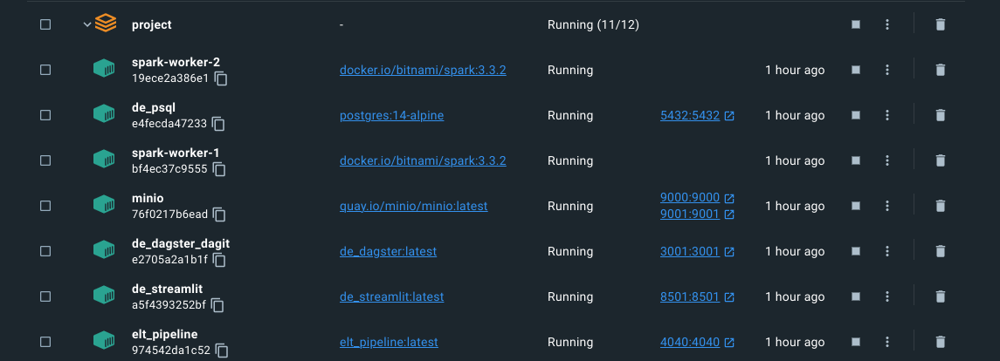

# goodreads-elt-pipeline

Trong project này mình sẽ hướng dẫn xây dựng một data pipeline cơ bản theo mô hình ELT (extract - load - transform), sử dụng bộ dữ liệu từ goodreads để ingest, transform data phục vụ hệ thống recommend sách cho bản thân.

Project này hoàn thành dựa trên kiến thức đã học được từ khóa Fundamental Data Engineering 02 của AIDE. Xin gửi lời cảm ơn đặc biệt tới thầy Nguyễn Thanh Bình, anh Ông Xuân Hồng và anh Hùng Lê.

[Source code](https://github.com/lelouvincx/goodreads-elt-pipeline) của project.

## 1. Introduction

Mình thích đọc sách. Và mình có một chiếc máy đọc sách kindle dùng cho việc đọc hàng ngày.


Có một điểm mình thích ở chiếc kindle là nó có một địa chỉ email riêng biệt được amazon cấp phát. Nếu sử dụng email của mình để gửi file sách (dạng .epub/.mobi), hệ thống trên amazon sẽ tự động gửi file sách vào kindle giúp mình, miễn là có kết nối mạng.

Thế thì tại sao mình không tự build một app, có thể lấy data từ goodreads (một mạng xã hội cho các mọt sách), xử lý và đưa ra lời gợi ý cho những cuốn sách tiếp theo cho mình nhỉ? Và thế là project bắt đầu :D

## 2. Objective

Dataset cơ bản được lấy từ [Kaggle](https://www.kaggle.com/datasets/bahramjannesarr/goodreads-book-datasets-10m), [OpenLibrary API](https://openlibrary.org), [Google Drive API](https://developers.google.com/drive) và [Notion API](https://www.notion.so/lelouvincx/9dca269701b44d6b944c51a7f63b5b5a?v=4852b4d5cf8440e4bc232b0e25327f93)

Mục tiêu của project, là với nguồn data được thu thập và xử lý sẵn, khi người dùng nhập thông tin cuốn sách đã đọc, có thể gợi ý các cuốn sách tiếp theo. Nếu cuốn sách đó có file .epub, app sẽ hiện tính năng gửi sách vào kindle.

## 3. Design

### 3.1 Directory tree


- app: Giao diện để tương tác với người dùng, viết bằng streamlit
- dagster_home: Config cho dagit (dagster UI) và dagster daemon
- dataset: Lưu dataset dưới dạng .csv, mặc định load vào MySQL
- docker-compose: Compose docker containers
- dockerimages: Chứa các image tự build như dagster (dagit + daemon), spark master, streamlit app
- EDA.ipynb: Exploratory Data Analysis, xem trực tiếp [tại đây](https://gist.github.com/lelouvincx/a88fa6caf59d7ff76086ab485ecc69bd)
- elt_pipeline: Toàn bộ pipeline
  - dbt_transform: code location của dbt, dùng cho bước transform ở cuối
  - Dockerfile + requirements.txt: Thông tin build image
  - elt_pipeline: pipeline từ đầu tới trước dbt
- .env + .spark_master.env + .spark_worker.env: Lưu biến môi trường (ví dụ POSTGRES_USER, MYSQL_USER, SPARK, ...)
- env.template: Template để bạn tự điền thông tin biến môi trường
- .git + .gitignore: Thuộc git, quản lý code version
- Makefile: Shortcut câu lệnh trên terminal
- load_dataset: Chứa script .sql để tạo schema và load vào database MySQL và Postgres
- requirements.txt + Pipfile + Pipfile.lock: Dependencies của python

Ngoài ra còn có các thư mục sở hữu riêng của container:

- minio
- storage
  - mysql_data
  - postgres_data
  - metabase_data

Chi tiết xem ở file [tree.txt](https://github.com/lelouvincx/goodreads-elt-pipeline/blob/main/tree.txt)

### 3.2 Pipeline design


0. Ta sử dụng `docker` để đóng gói ứng dụng và `dagster` để orchestrate assets (theo [định nghĩa](https://docs.dagster.io/concepts/assets/software-defined-assets) của daster)
1. Dữ liệu Goodreads được download từ kaggle dưới dạng `.csv`, sau đó import vào `MySQL` mô phỏng dữ liệu development
2. Sau khi có thông tin `ISBN` (mã định danh quốc tế) của sách, tiến hành collect thêm data từ các api liên quan
   - Genre, author, pages number, image, description từ `OpenLibrary API`
   - Download link từ `Notion API`
   - Epub file từ `Google Drive API`
   - Image từ `OpenLibrary API` hoặc `Google Drive API`
3. Extract dữ liệu dạng bảng ở trên bằng `polars`, load vào datalake - `MinIO`
4. Từ `MinIO` load ra `spark` để transform thành layer silver và gold
5. Convert `Spark DataFrame` thành `parquet`, load lại vào `MinIO`
6. Gold layer được load tiếp vào data warehouse - `postgreSQL`, tạo thành warehouse layer
7. Transform tùy mục đích bằng `dbt` trên nền `postgres`
8. Trực quan hóa dữ liệu bằng `metabase`
9. Giao diện app gợi ý sách bằng `streamlit`

### 3.3 Database schema


1. `book`: OLTP table chứa thông tin cuốn sách (ISBN, Authors, Rating, Description...)
2. `genre`: table chứa tên các thể loại sách
3. `book_genre`: quan hệ n-n giữa `book` và `genre`
4. `book_download_link`: table chứa link google drive để tham chiếu `BookFile`
5. `files`: object storage chứa file download sách (.epub/.pdf/.mobi)
6. `images`: object storage chứa hình ảnh cuốn sách

### 3.4 Datalake structure


1. Datalake chia theo các layer: bronze, silver, gold
2. Các loại file đều dạng .parquet để cho kết quả đọc tốt hơn .csv
3. Ngoài ra có files: lưu file .epub theo dạng abc.epub, trong đó abc là ISBN của cuốn sách
4. Tương tự, abc.jpeg lưu hình ảnh của cuốn sách

### 3.5 Data lineage

1. Tổng quan


Với data lineage dày đặc, dagster là big help khi có thể visualize chúng một cách trực quan:

- Dữ liệu xuất phát từ MySQL và các loại API, load vào bronze layer
- Từ bronze layer, dữ liệu được dedupe, clean và fill missing ở silver layer
- Sau đó tính toán nâng cao và phân tách ở gold layer
- Load vào data warehouse - Postgres ở warehouse layer
- Và cuối cùng, transform theo nhu cầu ở recommendations layer bằng dbt

2. Bronze layer


Gồm các asset:

- bronze_book: Bảng `book` từ MySQL, vì quá lớn (trên 1.2 triệu dòng nên được partitions theo năm từ 1975 tới 2022)
- bronze_genre: Bảng `genre` từ MySQL
- bronze_book_genre: Bảng `book_genre` từ MySQL
- bronze_book_download_link: Bảng `book_download_link` từ MySQL
- bronze_images_and_files_download: Đảm nhận việc kết nối tới google drive api, kéo file .epub và hình ảnh về, lưu trong datalake

3. Silver layer


Gồm các asset:

- silver_cleaned_book: Clean data từ upstream `bronze_book`, được partition để đảm bảo `spark standalone mode` có thể chạy
- silver_collected_book: Collect thêm missing data từ upstream như authors, pages number, description từ `OpenLibrary API`
- silver_isbn: Tách cột isbn từ `book` để làm dependency cho asset liên quan tới `genre`
- silver_cleaned_genre: Tương tự `silver_cleaned_book`, khác cái không cần partition vì size không lớn lắm
- silver_collected_genre: Dựa vào `silver_isbn`, collect thêm genre cho mỗi cuốn sách bị thiếu genre. Nếu không có genre thì không thể làm recommendations cho các task sau
- silver_collected_book_genre: Kết nối quan hệ n-n giữa `book` và `genre`

4. Gold layer


Gồm các asset:

- gold_genre: Tính toán, sắp xếp các genre cho phù hợp từ upstream `silver_collected_genre`, đồng thời lưu vào minIO
- gold_book_genre: Tương tự, từ upstream `silver_collected_book_genre`
- gold_with_info: Phân tách, chỉ chứa thông tin cơ bản về cuốn sách như ISBN, Name, Authors, Language, PagesNumber
- gold_with_publish: Phân tách, chỉ chứa thông tin về nhà xuất bản, thời gian xuất bản
- gold_with_rating: Phân tách và tính toán các loại rating

5. Warehouse layer


Load các asset từ gold layer vào postgres. Trong đó có 1 asset từ bronze layer là book_download_link.

Trong tương lai sẽ cập nhật asset để bổ sung download link tự động từ Notion API, và thiết lập schedule.

6. Transform layer


Gồm các model (asset):

- search: Transform thông tin để tạo bảng index, khi người dùng tìm kiếm sẽ query trên bảng này
- search_prior: Cũng là bảng index, nhưng chứa các cuốn sách được ưu tiên hơn dựa vào việc có download link, OpenLibrary API hoạt động, rating cao, ...
- criteria: Tiêu chí để query những cuốn sách liên quan khi tìm kiếm 1 cuốn sách

## 4. Setup

### 4.1 Prequisites

Để sử dụng pipeline này, download những phần mềm sau:

1. [Git](https://git-scm.com/book/en/v2/Getting-Started-Installing-Git)
2. [Docker](https://docs.docker.com/engine/install/) ít nhất 4GB RAM, 6 core CPU, 2GB swap, 16GB disk
3. [CMake](https://cmake.org/install/), nếu dùng hệ máy UNIX (Linux/MacOS), check `make --version` được cài sẵn
4. Python 3.x (3.9.16 recommended vì image của spark chạy trên version này, khuyến khích cài bằng asdf) và môi trường ảo (pipenv recommended)
5. Máy local đã free các port sau: 3306, 5432, 9000, 9001, 3001, 8501, 4040, 7077, 8080, 3030
6. Dbeaver hoặc một db client bất kỳ (nếu không có thể dùng command-line)

Nếu dùng Windows, setup thêm WSL2 và một máy ảo local Ubuntu, cài đặt những thứ trên cho ubuntu.

### 4.2 Setup local infrastructure

Clone repository:

```bash
git clone https://github.com/lelouvincx/goodreads-elt-pipeline.git project
cd project

# Create env file
touch .env
cp env.template .env
touch .spark_master.env
cp spark_master.env.template .spark_master.env
touch .spark_worker.env
cp spark_worker.env.template .spark_worker.env
```

Sau đó điền thông tin biến môi trường vào 3 file env trên. Dưới đây là ví dụ:

```env
# MySQL
MYSQL_HOST=de_mysql
MYSQL_PORT=3306
MYSQL_DATABASE=goodreads
MYSQL_USER=admin
MYSQL_PASSWORD=admin123
MYSQL_ROOT_PASSWORD=root123

# PostgreSQL
POSTGRES_HOST=de_psql
POSTGRES_PORT=5432
POSTGRES_USER=admin
POSTGRES_PASSWORD=admin123
POSTGRES_DB=goodreads
POSTGRES_HOST_AUTH_METHOD=trust

# Google Drive
GDRIVE_CLIENT_SECRET_FILE=client_secret.json
GDRIVE_PICKLE_FILE=token_drive_v3.pickle
GDRIVE_API_NAME=drive
GDRIVE_API_VERSION=v3
GDRIVE_SCOPES=https://www.googleapis.com/auth/drive.readonly

# Dagster
DAGSTER_PG_HOSTNAME=de_psql
DAGSTER_PG_USERNAME=admin
DAGSTER_PG_PASSWORD=admin123
DAGSTER_PG_DB=postgres
DAGSTER_OVERALL_CONCURRENCY_LIMIT=1
DAGSTER_HOME=/opt/dagster/dagster_home

# dbt
DBT_HOST=de_psql
DBT_USER=admin
DBT_PASSWORD=admin123
DBT_DATABASE=goodreads
DBT_SCHEMA=recommendations
# MinIO
MINIO_ENDPOINT=minio:9000
MINIO_ROOT_USER=minio
MINIO_ROOT_PASSWORD=minio123
MINIO_ACCESS_KEY=minio
MINIO_SECRET_KEY=minio123
DATALAKE_BUCKET=lakehouse
AWS_ACCESS_KEY_ID=minio
AWS_SECRET_ACCESS_KEY=minio123
AWS_REGION=us-east-1

# MinIO client (mc)
AWS_ACCESS_KEY_ID=minio
AWS_SECRET_ACCESS_KEY=minio123
AWS_REGION=us-east-1

# Spark
SPARK_MASTER_URL=spark://spark-master:7077
SPARK_VERSION=3.3.2
HADOOP_VERSION=3

# Metabase
MB_DB_TYPE=postgres
MB_DB_DBNAME=goodreads
MB_DB_PORT=5432
MB_DB_USER=admin
MB_DB_PASS=admin123
MB_DB_HOST=de_psql
MB_DB_FILE=/metabase_data/metabase.db
```

Bạn có thể thay các thông tin về user, pasword, ...

**Chỉ dùng cho development, không dùng cho production.**

Bây giờ chúng ta import dataset spotify (dạng csv) vào mySQL:

Chạy các lệnh sau để setup:

```bash
# DO NOT RUN BOTH BELOW COMMANDS, ONLY CHOOSE ONE
# Setup python environment
pipenv install
# Or create virtualenv and install manually by requirements.txt
make install

# Build docker images
make build-dagster
make build-spark
make build-pipeline
make build-streamlit

# Run containers dettached
make up-bg

# Check running containers
docker compose ps -a

# Check code quality
make check
make lint

# Format pipelines
black ./elt_pipeline

# Test coverage
make test
```

Lúc này sẽ có 11 services sau đang chạy:




**Ports**:

- MySQL: 3306
- PostgreSQL: 5432
- Dagit: 3001
- MinIO
  - UI: 9001
  - API: 9000
- Spark master:
  - UI: 8080
  - API: 7077
- Pipeline:
  - Spark jobs running: 4040
- Metabase: 3030
- Streamlit: 8501

### 4.3 Import data into MySQL

Source từng file theo thứ tự:

```bash
make to_mysql_root
```

```sql
SET GLOBAL local_infile=TRUE;
-- Check if local_infile was turned on
SHOW VARIABLES LIKE "local_infile";
exit
```

```bash
# Create tables with schema
make mysql_create

# Load csv into created tables
make mysql_load
```

### 4.4 Create schema in Postgres

```bash
make psql_create
```

### 4.5 User interfaces

1. <http://localhost:3001> - Dagit
2. <http://localhost:4040> - Spark jobs
3. <http://localhost:8080> - Spark master
4. <http://localhost:9001> - MinIO
5. <http://localhost:3030> - Metabase
6. <http://localhost:8501> - Streamlit

## 5. Considerations

Giờ là lúc đánh giá project:

1. Tốc độ: `spark` được cài ở chế độ standalone nên không đạt hiệu suất cao, đôi khi bị crash giữa chừng khi thực hiện các task shuffle/read/write
2. Môi trường phát triển: Hiện tại mới có develop, tương lai sẽ xem xét môi trường testing, staging, production
3. `dbt` hiện tại là project nhỏ, tương lai nếu cần transform nhiều thì cần tách service riêng, phân quyền, ...
4. Deployment: Sử dụng một trong các dịnh vụ điện toán đám mây: AWS, Azure, GCP

## 6. Further actions

1. Hoàn thiện recommender system
2. Tích hợp jupyter notebook để làm task của DS (dagstermill)
3. Testing environment
4. Continuous Integration
